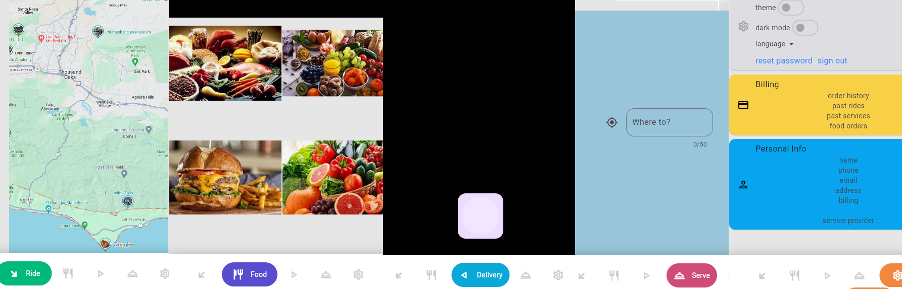

# Delivery Management App
A free download to build a complete Truck/Services/delivery ride app in Flutter and Parse Framework (Back4app/MongoDB)

`upgraded to DART 3.4 & Flutter 3.22`

## Connect

## [Video Tutorials](https://www.youtube.com/playlist?list=PLp0TENYyY8lF4iUFdA5SRyNacw_w2mp2w)

[Demo Page](https://amitxshukla.github.io/Delivery/)

## Installation

> Sign up at back4app.com and copy your keys into main.dart

## Features
- Flutter, Parse Framework back-end (Back4App / MongoDB)
- Multilingual
- Dark and Light Theme
- Driver and Customer
- Bid based interface
- Image/File uploads
- Role based Architecture
- App Message / Notification feature
- email login verification

## Pro Features
- search nearby drivers
- discounted rides
- food, service and other deliveries
- Advertise with us
- live maps
- live push notifications
- blue badge drivers
- advance cloud code functions based security

## License Agreement

[License Information](https://github.com/AmitXShukla/Delivery/blob/main/License)

## Privacy Policy

[Privacy Policy](https://github.com/AmitXShukla/Delivery/blob/main/License)
